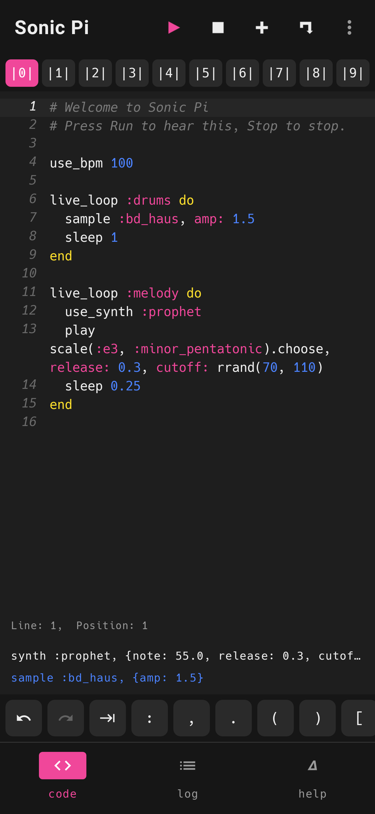
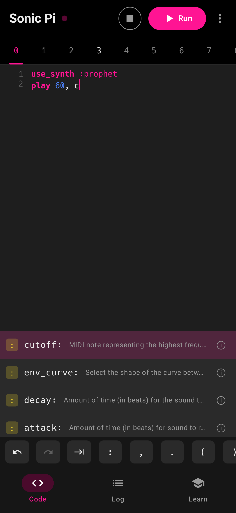
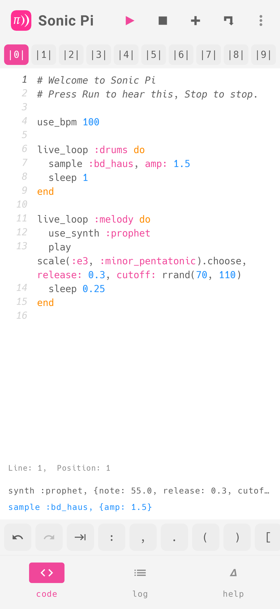

# Sonic Pi for Android

[Sonic Pi](https://sonic-pi.net), running natively on an Android phone or
tablet: the live-coding language, the synths, the samples and the FX, all on
the device, with no server and no network.

<p>
  
  
  
</p>

## How it works

Sonic Pi itself is not copied into this repository. It is the `sonic-pi`
submodule, which tracks the `dev` branch of
[sonic-pi-net/sonic-pi](https://github.com/sonic-pi-net/sonic-pi). The app is
built from three of its parts:

- **The language.** Sonic Pi's mruby runtime (`app/web/runtime`), the one its
  web version runs, is compiled to native code for each Android ABI.
- **The engine.** SuperSonic, which is scsynth on clockwork
  (`app/external/supersonic`), runs in the app's own process. It renders into
  a low-latency AAudio stream.
- **The data.** The app is packaged with the synthdefs, samples, examples,
  language reference and editor completion data, all from the submodule.

What this repository adds:

| Path | What it is |
| --- | --- |
| `native/` | The core: the runtime and the engine in one library, joined by a small host (`sonic_pi_core.cpp`). It has a desktop test that renders programs to audio and checks what they played. |
| `android/` | The app: Kotlin and Jetpack Compose, with AAudio output and JNI under `app/src/main/cpp`. |
| `patches/` | The few changes the upstream sources need, as `.patch` files. The native build applies them to the submodule when it configures. |
| `.github/workflows/android.yml` | CI. It builds the core and the app, runs the tests and uploads the APKs. |

### Patches

The upstream sources need only one patch:

- **`clockwork-android.patch`**
  - Android's libc has no `librt` and no POSIX shared memory, so these are not linked or called. The app never takes the paths that need them.
  - The build lets clockwork link a Rust core compiled for the Android target.

`native/CMakeLists.txt` applies each patch once and leaves a patch that is
already applied alone. That is why the submodule shows as modified after a
build. `.gitmodules` sets `ignore = dirty` so this doesn't clutter
`git status`.

## The app

The app is made for a phone, in Sonic Pi's design language:
- **Layout:** a top bar, with tabs at the bottom (a rail on a tablet).
- **Colours:** the desktop's light and dark themes (`sonicpitheme.cpp`). The dark theme sits on the desktop's editor grey, with a slightly softer pink.
- **Light or dark:** the app follows the phone's mode.
- **Icons:** the toolbar glyphs (▶ ■ + ⌐ Δ) are the web version's own, tinted as it tints them. The app's icon, in the launcher and the top bar, is Sonic Pi's own, from the submodule; the build also cuts out its white glyph for Android's themed icons.

- **Code.**
  - The top bar has run, which turns pink while a program plays, plus stop, load and save. A menu holds text size and clear log.
  - There are ten buffers, as on the desktop, as `|0| |1| … |9|` tabs above the editor. They are saved as you type.
  - The editor has Sonic Pi's syntax colours and its Hack font. Line numbers are in italics, the caret's line is marked, and there is a `Line: N, Position: M` readout. New lines are auto-indented, and the line of an error is marked after a failed run.
  - The log's last lines show under the code.
  - A bar above the keyboard has the symbols code needs, plus undo, redo and indent.
- **IntelliSense.**
  - What the editor offers as you type is what Sonic Pi's desktop editor offers. It uses a port of upstream's completion engine (`app/web/app/src/completion`, itself ported from the desktop's `completion_context.cpp`) on the same `completion.json`. Examples:
    - samples after `sample`
    - synths after `use_synth`
    - the current synth's own opts after `play 60,`
    - an FX's opts in `with_fx`
    - notes, chords and scales
    - function names once two letters are typed
  - Ranking uses the desktop's fuzzy matching.
  - Put the caret on a function, synth, FX, sample or opt and a line under the code says what it is. Tap the line, or the ⓘ on a suggestion, to open the full doc.
- **Log and cues.**
  - The log uses the desktop's format: a `{run: 1, time: 0.5, thread: :drums}` header for each moment, with what played beneath it on `├─`/`└─` branches.
  - The cues pane lists every cued path.
  - On a tablet both sit beside the code, as the desktop's side column does.
- **Help.**
  - The desktop's help panel, with pill tabs for Examples, Lang, Synths, Fx and Samples.
  - Each tab has a filter and a list, and each page has a pink title and rule.
  - Code opens into the current buffer, and tapping a sample plays it.
  - The splash screen is the desktop's logo.

### Android 16 and storage

The app targets API 36 (Android 16) and needs Android 11 (API 30) or later.

It asks for no storage permission:

- The buffers and the unpacked sounds live in the app's private storage.
- Opening a `.rb` file and saving a buffer go through the system file picker (the Storage Access Framework), so you choose the file each time.

Builds are 16 KB page aligned. They draw edge to edge and support predictive back.

## Building

You need:

- the Android SDK, with platform 37, build-tools 36 and NDK `29.0.14206865`;
- CMake 3.31;
- JDK 21;
- Ruby (to build mruby);
- Rust with the `aarch64-linux-android` and `x86_64-linux-android` targets.

```sh
git clone --recurse-submodules -b claude/sonic-pi-android https://github.com/AlexDev404/sonic-pi-lsp sonic-pi-android
cd sonic-pi-android/android
./gradlew :app:assembleDebug          # app/build/outputs/apk/debug/
./gradlew :app:testDebugUnitTest      # editor, completion and screenshot tests
```

To build and test only the core, on Linux or macOS:

```sh
native/build-mruby.sh build/core
cmake -B build/native -S native -DSP_BUILD="$PWD/build/core"
cmake --build build/native --target sonic_pi_render_test
build/native/sonic_pi_render_test

# how hard a program works the core: every render and every turn of the runtime, timed
cmake --build build/native --target sonic_pi_load_bench
build/native/sonic_pi_load_bench native/test/programs/full_track.rb 120
```

## CI

Each push builds everything and uploads these artifacts:

| Artifact | What it holds |
| --- | --- |
| `sonic-pi-android-apk` | `sonic-pi-debug.apk` and `sonic-pi-release.apk` (the release APK is signed with the debug key) |
| `sonic-pi-android-screenshots` | The app's screens, drawn by the screenshot tests |
| `sonic-pi-native-renders` | Audio the core rendered from test programs |

## Licence

The code in this repository is under the AGPL-3.0-or-later. Sonic Pi's
licences are in its [LICENSE.md](https://github.com/sonic-pi-net/sonic-pi/blob/dev/LICENSE.md):

- Its main sources are MIT.
- Its web runtime (`app/web`) is AGPL-3.0-or-later. That includes the mruby runtime and the completion engine this app ports.
- SuperSonic and clockwork are AGPL-3.0-or-later.
- The samples, synthdefs and examples each have their own terms.
